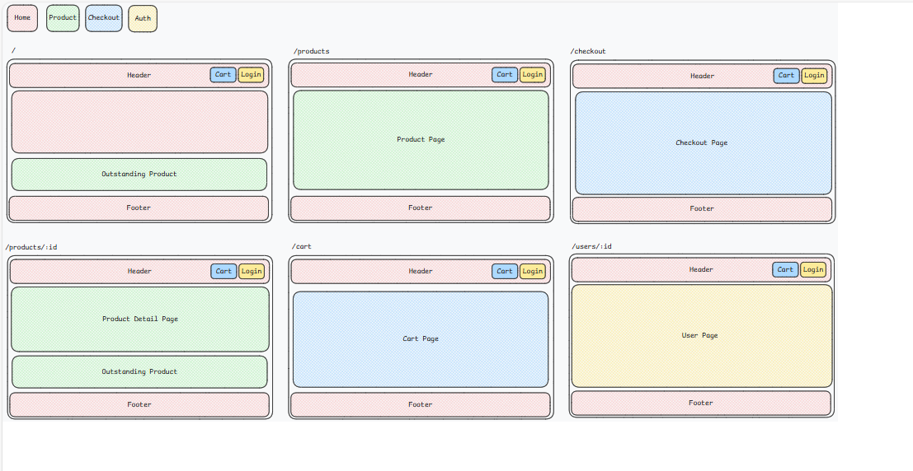
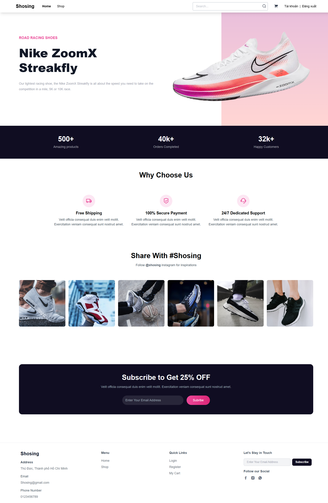
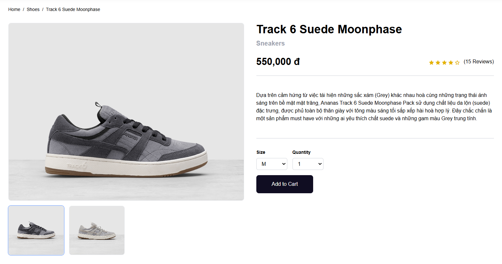
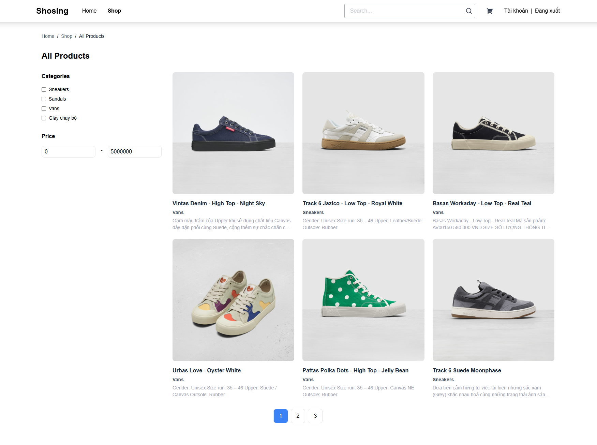

# MICRO FRONTEND - WEBSITE THƯƠNG MẠI ĐIỆN TỬ

Dự án này là một ứng dụng thương mại điện tử được phát triển theo kiến trúc **Micro Frontend**. 
Mỗi phần của ứng dụng sẽ được phát triển độc lập và tích hợp với nhau thông qua các giao diện API, giúp việc phát triển và bảo trì dễ dàng hơn. 

## Nội dung dự án

Website thương mại điện tử này cung cấp các chức năng cơ bản như:

- Quản lý sản phẩm
- Quản lý đơn hàng
- Quản lý giỏ hàng
- Xem chi tiết sản phẩm và tìm kiếm
- Thêm sản phẩm vào giỏ hàng
- Thanh toán
  
### Kiến trúc Micro Frontend
Dự án này áp dụng mô hình Micro Frontend để phân chia giao diện người dùng thành các module nhỏ, độc lập. Các module này có thể được phát triển và triển khai riêng biệt nhưng vẫn có thể hoạt động như 
một hệ thống hoàn chỉnh khi kết hợp lại. Cấu trúc dự án bao gồm:

  1. **Home**: Đảm nhiệm chức năng hiển thi trang chủ .
  2. **Product**: Hiển thi danh sách sản phẩm, chi tiết sản phẩm.
  3. **Checkout**: Quản lý giỏ hàng, mua hàng.
  4. **Auth**: Quản lý thông tin người dùng, đăng nhập và đăng ký.

### Micro frontends hoạt động như thế nào?

- Dựa trên ý tưởng đã nêu ra trước đó, chúng ta có thể tách phần FE của ứng dụng thành các thành phần nhỏ hơn, đảm nhiệm chức năng cụ thể.
- Ứng dụng gồm các thành phần như 
    + App shell: là nơi người dùng tương tác với ứng dụng. Có chức năng tập hợp các micro front-end lại với nhau và hiển thị cho người dùng. 
    + Các micro front-end là các ứng dụng độc lập có thể phát triển riêng
- Để các ứng dụng có thể tương tác với nhau, nhóm sử dụng module federation để chia sẻ và nhận components.

## Khi nào sử dụng Micro frontends

- **Ứng dụng lớn, phức tạp**: Giúp chia nhỏ và dễ quản lý các phần của ứng dụng.
- **Đội ngũ phát triển lớn**: Cho phép các nhóm làm việc độc lập trên các module mà không xung đột.
- **Hỗ trợ công nghệ khác nhau**: Kết hợp các framework và công nghệ khác nhau trong cùng một ứng dụng.
- **Độc lập triển khai và bảo trì**: Các module có thể được triển khai và nâng cấp riêng biệt mà không ảnh hưởng đến toàn bộ ứng dụng.
- **Khả năng mở rộng dễ dàng**: Dễ dàng thêm các tính năng mới mà không làm phức tạp hệ thống.
- **Tái sử dụng module**: Giảm thiểu việc phát triển lại khi sử dụng các module cho các ứng dụng khác.
- **Tốc độ phát triển nhanh**: Cho phép phát triển nhanh nhiều tính năng mà không gây gián đoạn các phần khác.
  
## Công nghệ sử dụng

Dự án này sử dụng các công nghệ sau:

- **ReactJS**: Framework JavaScript để xây dựng giao diện người dùng.
- **Webpack Module Federation**: Công cụ để kết nối các micro frontend module.
- **Node.js**: Máy chủ backend để phục vụ dữ liệu.
- **Express.js**: Framework web cho Node.js để xây dựng API.
- **CSS Modules / SCSS**: Quản lý kiểu dáng cho từng module độc lập.

## User Interface

## Authors

[Lê Quốc Dũng](https://github.com/DungLe2983)

[Phạm Thanh Đồng ](https://github.com/ThanhDong00)

